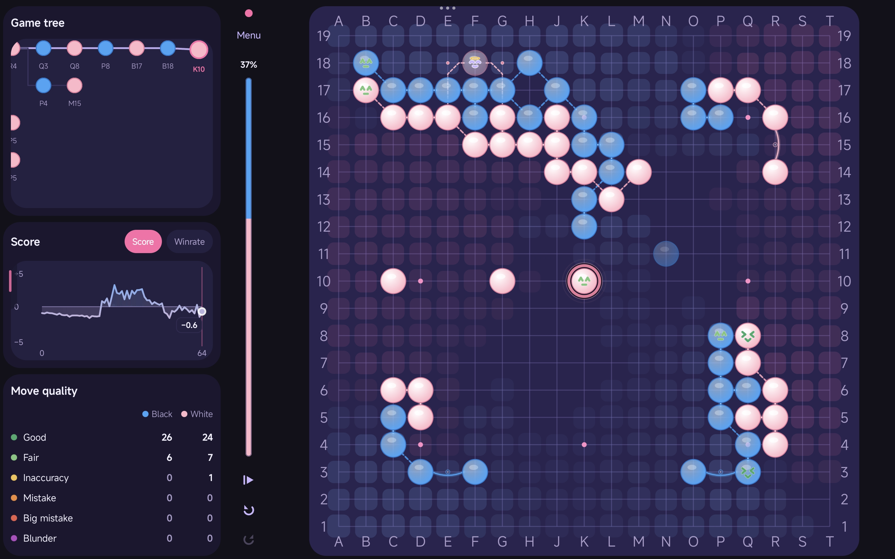
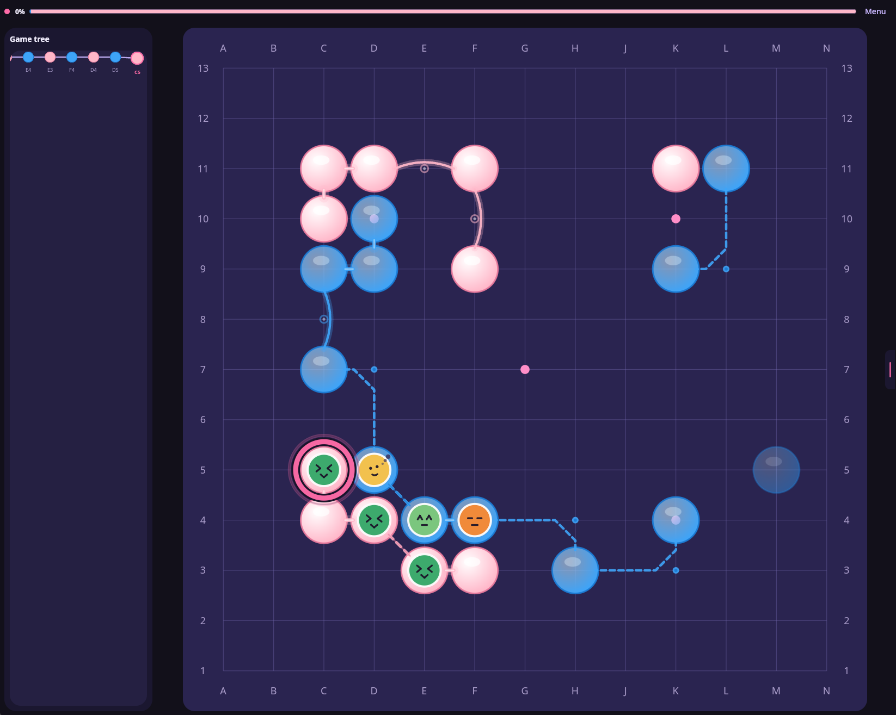
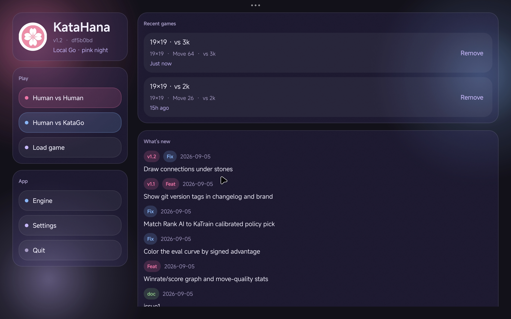
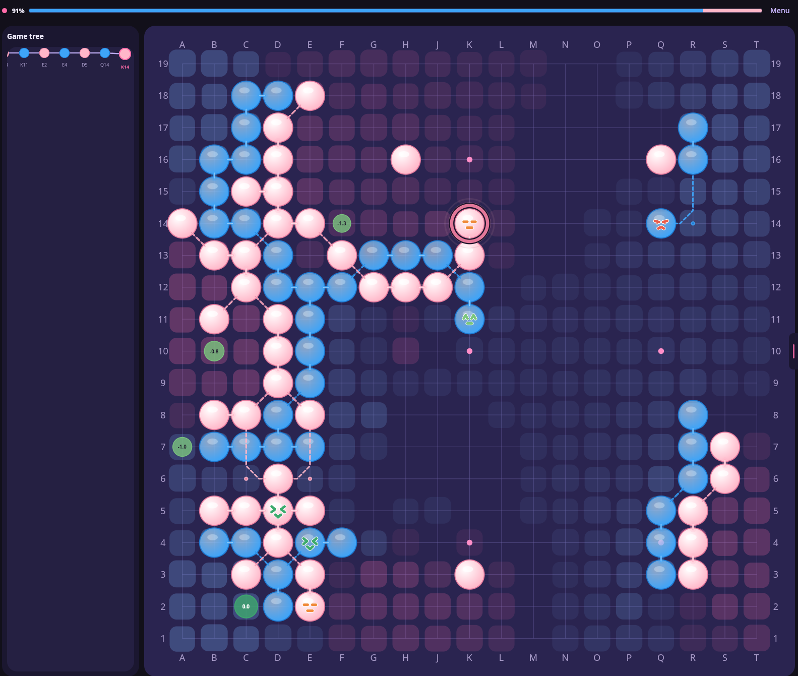
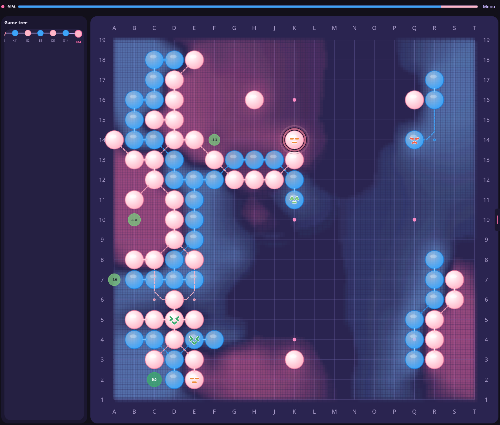
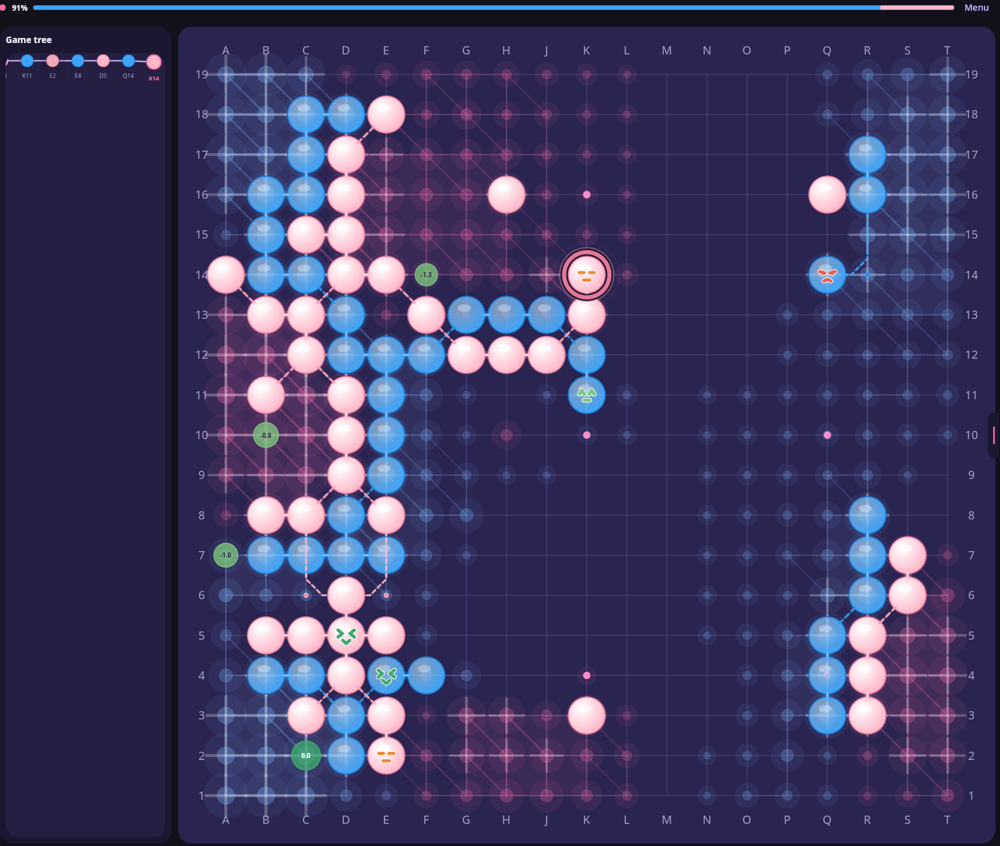
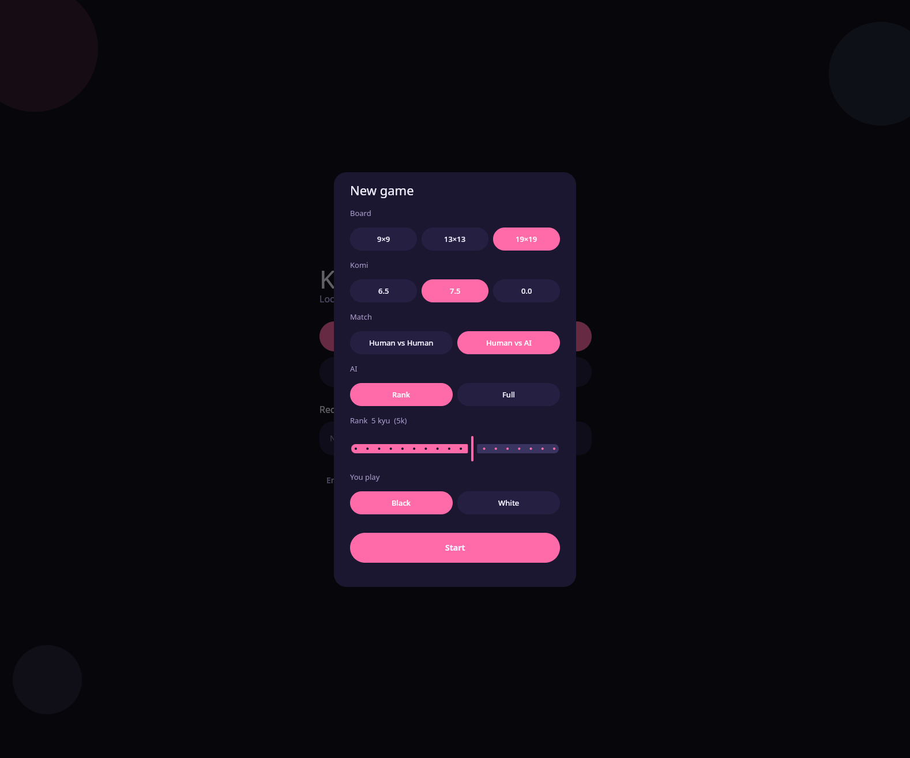
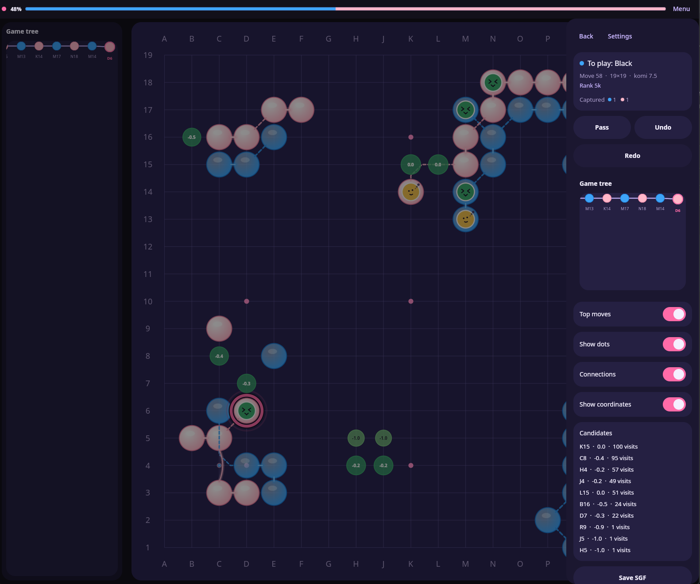
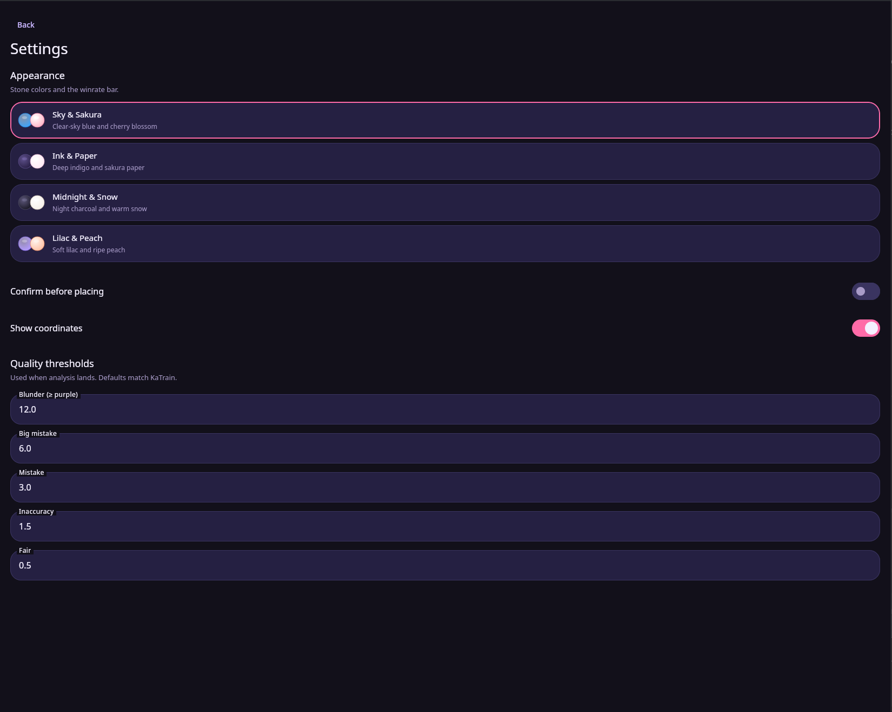
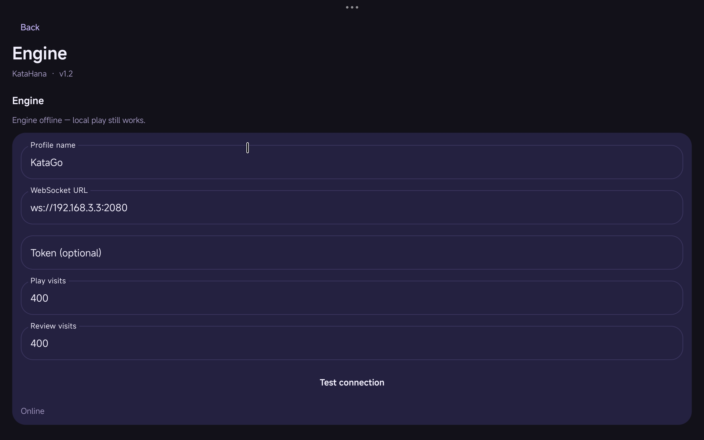

<p align="center">
  
</p>

<h1 align="center">KataHana</h1>

<p align="center">
  <strong>Local Go · pink night</strong><br/>
  A local-first client for playing and reviewing Go, with optional KataGo analysis over a WebSocket.
</p>

<p align="center">
  Desktop JVM · Android · Chinese rules · Human vs Human · Human vs AI
</p>

---

## What this is

KataHana is a Go client for two activities: playing games and reviewing them afterwards. It is written with Compose Multiplatform, so the game logic and most of the user interface live in one shared module and are reused by the desktop (JVM) build and the Android build; the repository also contains an iOS app shell. The app is fully local: the board, the rules, the game tree and the saved games all live on your device, which means there is no server to connect to, no account to register, and nothing that stops working when you are offline.

The project exists because of a trade-off that is common in Go software. Many tools assume that you have one of two things: either an online service to play on, or an engine installed locally. Both assumptions have a cost. A server keeps your game records on someone else's platform and makes them unusable without a connection. An engine, on the other hand, normally has to be bundled and configured for one kind of hardware, which is a real problem for KataGo because its binary is GPU-specific and therefore cannot be distributed as a single installable file. KataHana tries to avoid both assumptions: the game data belongs to you, and the engine is an external process that the app talks to only when it is available. The result is that Human vs Human always works, and AI support is an addition rather than a requirement.

The rest of the app follows from three decisions, and most of what is described in the sections below is a consequence of them.

- **The rules are implemented inside the app itself.** KataHana enforces the rules of Go locally: suicide is rejected, a repeated whole-board position is refused via positional superko, and two consecutive passes end the game. This means that a game can be played from start to finish without any engine attached, and that the engine is only ever asked for what it is good at, namely evaluation and move choice.
- **The engine is treated as a service, not as a dependency.** The client connects to any KataGo-compatible process over a plain WebSocket and exchanges KataGo's own Analysis JSON, one object per frame. Winrates are handled relative to Black throughout, so the numbers never change meaning halfway through a game. Since the connection is optional, the parts of the interface that depend on the engine simply stay empty or quiet when there is no engine to talk to.
- **An AI opponent is a per-color "seat" with a chosen strength, not a fixed setting.** Each color can be set independently to Human, Rank AI, Human-like or KataGo 9D+, and a seat can be changed in the middle of a game. In particular the engine is not always asked to play at full strength: the Human-like and Rank AI seats draw moves from the engine's policy output at a grade you choose between 15 kyu and 3 dan, which makes them lose games in believable, human-like ways and therefore makes them useful for practice against a weaker opponent.
- **The game tree is the model of a review.** Every move is a node in a branching tree, undo and redo walk that tree, and playing from an earlier position creates a variation. Because the engine only ever moves at a leaf of the tree and only on its own color, exploring a side line is never interrupted by an AI that "answers" out of nowhere.

The rest of this document goes through the app in the order in which you will meet its parts: first the home screen, then the board and the playing flow, then the analysis and review features, and finally the engine connection, the appearance settings, and the build instructions.

<p align="center">
  
</p>

## Features

The list below summarizes what stands out when you use the app. Each item is explained in more detail in its own section further down.

- **A board-first layout.** The board is the largest element on the screen, and the secondary controls stay out of the way until they are needed. The pass/undo/redo actions sit close to the board — in a slim top bar in portrait, in a rail on phones held sideways — and the winrate is shown as a single narrow bar. Save, candidate moves, the game tree and the overlay toggles are grouped in a drawer that you open from a small pink tab; on wide windows, part of that content is instead shown in a permanent column beside the board.
- **An evaluation graph whose vertical axis means something.** The graph shows score lead and winrate, and you can switch between the two with a small selector. In winrate mode the axis is fixed so that Black's 100% is at the top, White's 100% is at the bottom and 50% is in the middle; consequently a displayed value corresponds directly to a vertical position instead of to an offset that you have to decode. The curve is tinted towards whichever color is ahead, the newest sample carries a small live value label, and clicking anywhere on the plot moves the game tree to that move.
- **Move quality measured against the best move.** Each played move is compared with the best move the engine found, and the points lost decide a grade. The thresholds are KaTrain's defaults (12, 6, 3, 1.5 and 0.5 points), and they are editable in the settings. For the most recent moves of each color the grade is drawn on the board as a small face, and a table under the board counts how often each grade occurred for Black and for White.
- **Connection lines that are drawn under the stones.** The optional connection overlay shows the four connection shapes that Go players actually name (立 straight, 尖 diagonal, 飞 knight's move, 跳 one-point jump). Because the lines are rendered beneath the stones, they can never cover a stone or sit on top of a capture.
- **Ownership as an overlay rather than as a repaint.** The territory map that KataGo returns is drawn as a separate layer, so the stones and their colors stay fully visible. A new map cross-fades from the previous one instead of being swapped abruptly, and the whole layer can be switched off.
- **A review model based on a tree.** Undoing past the newest move puts you into review mode: the AI waits at the leaf, and if you play from an interior position the game branches into a variation. Redo follows the preferred line, and the engine never plays into a position that is not a leaf.
- **Games that survive a restart.** Saving a game stores it in the recent list together with per-move evaluations, so reopening it restores the position, the evaluation curve and the quality counts. If you back out of a game with unsaved moves, the app asks whether to keep them first, and plain SGF (FF[4]) export is available when the record has to go somewhere else.

All of these features can be seen at once on a 13×13 board: connection lines resting under the stones, faces on the newest moves, and the ring around the latest stone.

<p align="center">
  
</p>

---

## Home

The app opens on the home screen, which is built around two cards over a soft dark background. The first card is the recent list. Each entry shows the game's title and a one-line summary of the board size, the move number and the two players, and the whole saved game sits behind that row. Opening an entry therefore restores the position, the game tree and the evaluation curve as they were when you saved. The live details, such as the candidate moves and the ownership map, are re-requested from the engine once you are back at the board, because those are not stored in the save.

<p align="center">
  
</p>

The second card is **What's new**, a changelog that is generated from the project's own git history. Tagged commits carry a colored chip, and nothing is written by hand: the list is produced at build time from `git log`, and the version shown in the corner is taken from the nearest git tag (`v1.4.1` on the current tree, `v0.1-alpha` when the tree has no tags). This is described again in the code-layout section, because the mechanism lives in the Gradle build rather than in the app.

---

## Ownership

The ownership overlay uses the territory map that KataGo returns together with its analysis. You switch it on from the in-game drawer, and because the map changes with every move, each new map dissolves in from the previous one over a short cross-fade instead of snapping into place. The underlying data is always the same; what changes is how it is drawn, and there are three styles to choose from:

| Blocks | Fog | Constellation |
|:---:|:---:|:---:|
| One rounded tile per point | A continuous mist that blends over the board | Stars with faint faces and linking edges |
|  |  |  |

The idle animation is deliberately unobtrusive in all three styles: tiles bounce slightly, the fog drifts, and the constellation breathes and twinkles. The layer keeps itself translucent so that the stones underneath remain legible. One important distinction: the separate **Dead stones** toggle is not a style but an independent feature. When it is on, stones that KataGo considers dead are dimmed where they stand and ringed with a faint yellow halo, so that you can see the endgame picture without removing any stones from the board. This marking requires a live ownership evaluation for the current position, because the classification is read from the ownership map.

---

## Playing a game

A new game starts with the same questions that you would settle at a real table: the board size, the komi, and who sits on each color. The supported boards are 9×9, 13×13 and 19×19; the komi can be 6.5, 7.5 or 0, with 7.5 as the default; the rules are Chinese rules with positional superko; and coordinates are GTP coordinates, which means the letter I is skipped. The new-game sheet also remembers your last choices, so starting a similar game is a matter of a single tap.

<p align="center">
  
</p>

Once the game is running, the board keeps the center of the window and everything else is arranged around it. In the narrow/portrait layout, a top bar holds the engine status, the winrate bar and the pass/undo/redo actions, and a drawer on the left side (opened from a pink tab, or by swiping) contains the rest: whose turn it is and how many prisoners have been taken, the candidate moves, the game tree, the evaluation graph and the quality table, plus the toggles for faces, connection lines, coordinates, ownership and dead stones. On wide windows and on phones in landscape, the game tree, the evaluation graph and the quality table are instead shown in a permanent column beside the board, so that they stay visible while you play.

<p align="center">
  </p>

### Seats

The opponent for each color is chosen separately, which is what makes combinations such as AI vs AI possible even though the new-game sheet only offers Human vs Human and Human vs AI. The four seat types are:

- **Human** — a person plays this color on the same device.
- **Rank AI** — the engine is asked for a single-visit policy, and the seat draws a move from that policy using KaTrain's calibrated formula for the selected grade. This produces an opponent that is quick in local fights but weak in the ways a player of that grade would be weak.
- **Human-like** — the same single-visit query is used, but the engine is additionally asked for its human network via a `humanSLProfile` such as `preaz_5k`. The move is then sampled from that human policy, so the result plays like a person of the chosen rank rather than like a weakened engine.
- **KataGo 9D+** — the seat plays the strongest move the engine finds within the configured play-visit budget.

Rank AI and Human-like both accept a grade between 15 kyu and 3 dan (5 kyu is the default). You can change any seat from the side panel while a game is in progress; because opening the drawer pauses the AI, you can think about the change without the board moving underneath you.

### Review and analysis

Going back over a finished game is the other main use of the app, and it is built directly on the game tree. Undo past the newest move and you are in review: the current node has children, which is exactly what "reviewing" means here. From such an interior node, the next move belongs to the human, and placing a stone creates a variation that branches from that point. Redo walks forward along the preferred line, and the engine only ever moves at a leaf of the tree, on its own color. This guarantees that a line you are exploring is never hijacked by an AI move.

The evaluation shown in the graph and the quality table is collected move by move, which is why those features only appear once an engine is connected. Candidate moves with their variations (PV), points lost and visit counts are shown for the current position, and the **Analyze game** action reviews the whole preferred line in the background, requesting a full analysis for each node in turn.

### Saving and records

Saving works through the drawer: **Save** updates the current record, and **Save as** stores a copy under a new name. Both write the game to the recent list together with the per-move evaluations, which is what allows the evaluation curve and the quality counts to come back after a restart. Because the app tracks whether the position has changed since the last save, backing out of the game screen with unsaved moves triggers a dialog that offers to save, discard or cancel. SGF files can be opened and exported as well, in FF[4] format, which is the interchange format used by most other Go tools.

---

## Appearance and thresholds

The visual theme and the analysis thresholds are both configured on the settings screen. There are four stone/appearance pairs, each defining the colors of the two seats and therefore also the colors used for the winrate bar and for the curve:

- **Sky & Sakura** — clear-sky blue and cherry blossom (the default)
- **Ink & Paper** — deep indigo and sakura paper
- **Midnight & Snow** — night charcoal and warm snow
- **Lilac & Peach** — soft lilac and ripe peach

The winrate bar is painted with the two stone colors, with the boundary between them showing the current split, and the ring around the last move takes the color of the stone that was just played. The quality thresholds mentioned in the features section are edited on the same page, next to the ownership-style picker, so that grading and appearance live in one place.

<p align="center">
  
</p>

---

## The engine and the gateway

This section describes how the engine is connected and how the small gateway that ships with the repository works. The engine settings screen contains the connection profile (a WebSocket URL, an optional token, and separate visit budgets for play and for review) together with actions to test the connection and to run a benchmark. The benchmark measures a one-visit policy query, search runs at 80, 400 and 2000 visits, and a human-network probe, and it reports a verdict about whether the server is fast enough for comfortable play. It takes roughly 20 to 90 seconds.

All engine traffic is KataGo's Analysis JSON over a WebSocket, so there is no second protocol to keep in sync. Queries ask for `rootInfo`, `moveInfos`, `ownership`, `policy` and, when needed, `humanPolicy`. The winrate is stored and reported relative to Black. The Human-like and Rank AI seats use a one-visit query that requests a policy, because they only need to draw a move from it; the Human-like seat additionally sends a `humanSLProfile` (for example `preaz_5k`) on that same query. Live analysis and KataGo 9D+ moves spend the play-visit budget, while the queued **Analyze game** review spends the review-visit budget.

<p align="center">
  
</p>

If the engine is offline, the parts of the interface that depend on it (the graph, the quality marks, the ownership overlay, AI moves) simply do nothing or stay empty, and Human vs Human continues to work exactly as before.

### The shipped gateway

Because the engine client expects an address such as `ws://127.0.0.1:2080`, the repository includes a small Python gateway that serves exactly that URL. From the project root:

```bash
pip install -r engine/requirements.txt
python engine/server.py --katago /path/to/katago
```

The only dependency in `requirements.txt` is the `websockets` library. On the first run, the gateway creates the `model/` directory if it is missing and downloads two networks from KataGo's GitHub releases: the main network `b10c384h6nbttflrs` and the human-SL network `b18c384nbt-humanv0`, which the Human-like seat needs. You can skip the download with `--skip-download` if you have already placed the files yourself. Engine tuning parameters live in `engine/analysis.cfg`, and KataGo keeps its cache and logs in `engine/home/`. The KataGo binary itself is not downloaded, since it is GPU-specific; the gateway looks for it in this order: the path passed with `--katago`, then `engine/bin/katago`, then the `katago` executable on your `PATH`.

---

## Building and running

The desktop app can be launched directly from the repository:

```bash
./gradlew :desktopApp:run
# hot reload while developing
./gradlew :desktopApp:hotRun --auto
```

To have an engine available, run the gateway from the section above before starting the app (the networks land in `model/` on the first run):

```bash
pip install -r engine/requirements.txt
python engine/server.py --katago /path/to/katago
```

On iOS, open [`iosApp/`](./iosApp) in Xcode. One caveat: the SGF open/export dialogs are implemented for desktop and Android, so those two actions currently do nothing in the iOS shell.

### Android from the terminal

The Android app lives in the `:androidApp` module, with `applicationId` `com.acite.katahana`. Gradle needs to know where the Android SDK is, and that goes into `local.properties`:

```
sdk.dir=/path/to/Android/Sdk
```

`adb` is expected at `$sdk.dir/platform-tools/adb`, or already on your `PATH`.

**On a device.** Connect the phone with USB debugging enabled and accept the RSA prompt:

```bash
adb devices
```

The device should show as `device`, not `unauthorized` or `offline`. If several devices are connected, list them with `adb devices -l` and prefix every `adb` call with `-s <serial>`, or export `ANDROID_SERIAL=<serial>` so that Gradle uses the same device.

**Wireless** (Android 11+, Developer options → Wireless debugging):

```bash
adb pair <ip>:<pairing-port>
adb connect <ip>:<debug-port>
adb devices
```

**Release onto the phone.** Gradle builds, signs and installs the release APK, and adb starts it:

```bash
./gradlew :androidApp:installRelease
adb shell am start -n com.acite.katahana/.MainActivity
```

The same install, but keeping the APK file around:

```bash
./gradlew :androidApp:assembleRelease
adb install -r androidApp/build/outputs/apk/release/androidApp-release.apk
```

The `-r` flag replaces an existing installation. If adb reports `INSTALL_FAILED_UPDATE_INCOMPATIBLE`, the previously installed copy was signed with a different key, so uninstall it first and install again:

```bash
adb uninstall com.acite.katahana
adb install androidApp/build/outputs/apk/release/androidApp-release.apk
```

**Just the APK** (no device needed):

```bash
./gradlew :androidApp:assembleRelease
# androidApp/build/outputs/apk/release/androidApp-release.apk
```

Prefer a Play-style App Bundle:

```bash
./gradlew :androidApp:bundleRelease
# androidApp/build/outputs/bundle/release/androidApp-release.aab
```

A note on signing: the release build currently signs with the **debug** keystore (`signingConfig = signingConfigs.getByName("debug")` in `androidApp/build.gradle.kts`) and keeps minification disabled. That is why `installRelease` works without a keystore of your own; the artifact is still a real release variant with `debuggable=false`. A Play Store upload will need its own signing configuration later.

**Debug** (what IDE run configurations typically install):

```bash
./gradlew :androidApp:installDebug
# or
./gradlew :androidApp:assembleDebug
# androidApp/build/outputs/apk/debug/androidApp-debug.apk
```

### Tests

The shared logic is covered by unit tests that run on the JVM and on an Android host:

```bash
./gradlew :shared:jvmTest
./gradlew :shared:testAndroidHostTest
```

---

## Code layout

The project is a Kotlin Multiplatform setup with three Gradle modules: `shared` contains the game logic and the Compose UI, and `androidApp` and `desktopApp` are thin launchers. The iOS app in `iosApp/` wraps the same shared UI. Within `shared`, everything that does not depend on a specific operating system lives in `commonMain`; the `jvmMain`, `androidMain` and `iosMain` source sets only supply the pieces that each platform must provide, such as file access, the settings path, the HTTP/WebSocket client engine and screen-lifecycle hooks.

The engine client is a thin WebSocket connection in the `engine/` package. The version label and the changelog on the home screen are not hard-coded: a Gradle task in `shared/build.gradle.kts` runs a few `git` commands at build time and generates a small Kotlin file that the UI reads. Navigation uses Voyager, dependency injection uses Metro, and preferences are stored with DataStore.

```
shared/src/commonMain/kotlin/com/acite/katahana/
  domain/     game tree, rules, connections, eval series
  engine/     WebSocket client, Analysis JSON, ownership
  ai/         HumanBot, RankBot, FullStrengthBot, quality bands
  settings/   preferences and ownership styles
  recents/    save / save-as shelf, persisted evaluations
  changelog/  git tags into the home log
  sgf/        SGF read / write
  ui/         board, session, home, theme
```
