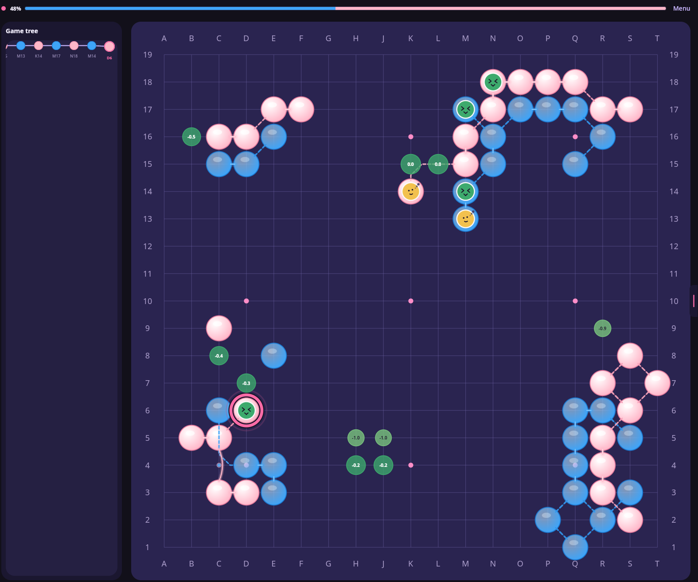

<p align="center">
  
</p>

<h1 align="center">KataHana</h1>

<p align="center">
  <strong>Local Go · pink night</strong><br/>
  A Compose Multiplatform client for playing and reading Go — with KataGo on the side, not in the skin.
</p>

<p align="center">
  Desktop JVM · Android · Chinese rules · Human vs Human · Human vs AI
</p>

---

KataHana is a local Go board that happens to speak [KataGo](https://github.com/lightvector/KataGo) Analysis JSON. The rules, the tree, and the stones live on your device. The engine is optional: Human vs Human still works when the WebSocket is down. Human vs AI does not default to a silent 9-dan — you pick a rank, or you ask for full strength.

No wood grain. No museum beige. Night purple, sakura pink, sky-blue stones.

<p align="center">
  
</p>

---

## Why it feels different

**The board comes first.** Winrate sits in a slim bar. Status, pass/undo, candidates, and toggles live in a pink-tab drawer. Wide windows get the game tree on the left; phones keep it in the menu.

**Faces, not traffic lights.** Recent moves wear little expressions for blunders through good shape — KaTrain-style score-loss bands, drawn as faces so a 19×19 still reads at a glance.

**Connections that know Go.** Optional overlay for 立 / 尖 / 飞 / 跳. Same-kind rings stay complete; a solid 2×2 keeps four nobi and drops the crossing kosumi.

**Review is a tree, not a tape.** Undo off a leaf and you are reviewing — the AI waits. Play a new stone and you branch. Redo walks the preferred line. AI only moves at a leaf, on its color.

<p align="center">
  
</p>

---

## Play

Start a game the way you actually think about one: board size, komi, opponent, color.

<p align="center">
  
</p>

| | |
|---|---|
| **Boards** | 9×9, 13×13, 19×19 |
| **Rules** | Chinese, positional superko, GTP coordinates (skip I) |
| **Human vs Human** | Same device, no network |
| **Human vs AI** | **Rank** — KaTrain-calibrated policy sampling, 15k through 3d, default 5k. **Full** — KataGo’s top move. |
| **Review** | Undo / redo / click the tree. Non-leaf = you own the next stone. |
| **Records** | Open and save SGF (FF[4]) |

The side menu is the rest of the table: to-play, captures, top moves with score loss, and the toggles for dots, connections, and coordinates.

<p align="center">
  
</p>

---

## Looks

Four stone palettes, and the winrate bar follows them.

- **Sky & Sakura** — clear-sky blue and cherry blossom (default)
- **Ink & Paper** — deep indigo and sakura paper
- **Midnight & Snow** — night charcoal and warm snow
- **Lilac & Peach** — soft lilac and ripe peach

Quality thresholds live next door. Defaults match KaTrain (`12 / 6 / 3 / 1.5 / 0.5`).

<p align="center">
  
</p>

---

## KataGo, on a socket

Point the client at an Analysis engine:

```
ws://127.0.0.1:2080
```

One JSON object per WebSocket text frame — KataGo’s own `rootInfo`, `moveInfos`, and `policy`. Winrates are stored as Black. Rank queries ask for policy; live analysis and full-strength genmove use your play visits.

Engine offline? Human vs Human still plays. The analysis chrome just goes quiet.

---

## Run it

```bash
# Desktop
./gradlew :desktopApp:run
# hot reload
./gradlew :desktopApp:hotRun --auto

# Android
./gradlew :androidApp:assembleDebug
```

iOS: open [`iosApp/`](./iosApp) in Xcode.

### Tests

```bash
./gradlew :shared:jvmTest
./gradlew :shared:testAndroidHostTest
```

---

## Inside

Compose Multiplatform (`shared` + `androidApp` + `desktopApp`). Voyager for navigation, Metro for DI, DataStore for settings. Board, rules, and SGF are pure Kotlin. The engine client is a thin WebSocket — no second protocol.

```
shared/src/commonMain/kotlin/com/acite/katahana/
  domain/     GameTree, Rules, connections
  engine/     WsClient, Analysis JSON
  ai/         RankBot, FullStrengthBot, quality bands
  sgf/        SGF read / write
  ui/         board, session, home, theme
```

---